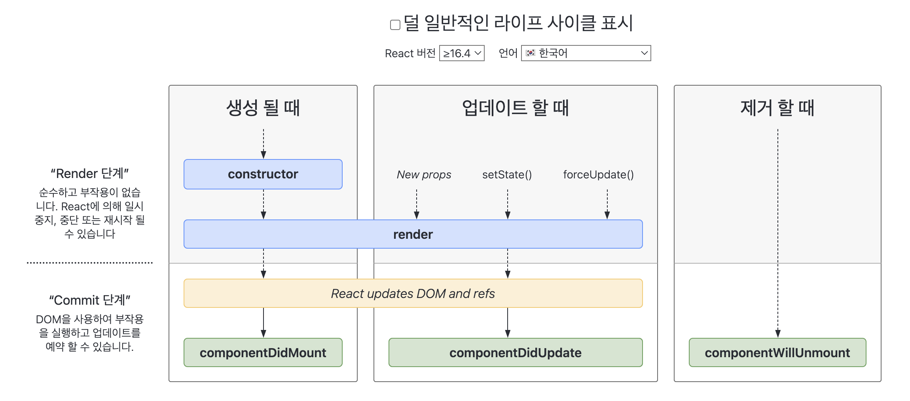

# 2.3 클래스 컴포넌트와 함수 컴포넌트

> ### You will learn 🤔
>- 2.3.1 클래스 컴포넌트
>- 2.3.2 함수 컴포넌트
>- 2.3.3 함수 컴포넌트 vs. 클래스 컴포넌트

---

함수 컴포넌트는 리액트 0.14 버전부터 만들어진 꽤 역사가 깊은 방식이다..! 😧
처음 소개될 때는 `stateless functional component`, 즉 `무상태 함수 컴포넌트`라고 해서  
생명주기 메서드나 상태가 필요 없이 **render만 하는 경우**에만 제한적으로 사용됐다.  
함수 컴포넌트가 각광받기 시작한 것은 16.8 버전에서 **hook**이 소개된 이후였다.  
이때부터 상대적으로 보일러플레이트가 복잡한 클래스 컴포넌트보다 함수 컴포넌트를 더 많이 쓰기 시작했다.  

---

# 2.3.1 클래스 컴포넌트
- 클래스 컴포넌트를 만들려면 클래스를 선언하고 extends로 만들고 싶은 컴포넌트를 extends해야 한다.
- extends 구문에 넣을 수 있는 클래스는 아래 두 개
    - React.Component
    - React.PureComponent
    - 이 둘의 차이점은 shouldComponentUpdate를 다룰 때 다름

클래스 컴포넌트의 구성요소들을 살펴보자

## 1) 클래스 컴포넌트의 구성요소

```js
import React from 'react';

// props 타입 선언
interface SampleProps {
  required?: boolean;
  text: string;
}

// state 타입 선언
interface SampleState {
  count: number;
  isLimited?: boolean;
}

// 컴포넌트에 제네릭으로 props, state를 순서대로 넣어준다.
class SampleComponent extends React.Component<SampleProps, SampleState> {
  // constructor에서 props를 넘겨주고, state의 기본값을 설정한다.
  private constructor(props: SampleProps) {
    super(props);
    this.state = {
      count: 0,
      isLimited: false,
    };
  }

  // render 내부에서 쓰일 함수 선언
  private handleClick = () => {
    const newValue = this.state.count + 1;
    this.setState({ count: newValue, isLimited: newValue > 10 });
  };

  // 렌더링할 내용 정의
  render() {
    //props와 state 값을 this, 즉 해당 클래스에서 꺼낸다.
    const {
      props: { required, text },
      state: { count, isLimited },
    } = this;

    return (
      <div>
        <p>{required}</p>
        <p>{text}</p>
        <p>{count}</p>
        <button onClick={this.handleClick} disabled={isLimited}>
          증가
        </button>
      </div>
    );
  }
}

```

### 1-1) constructor()

```js
  // constructor에서 props를 넘겨주고, state의 기본값을 설정한다.
  private constructor(props: SampleProps) {
    super(props);
    this.state = {
      count: 0,
      isLimited: false,
    };
  }
```

- 컴포넌트 내부에 이 생성자 함수가 있으면 컴포넌트가 초기화되는 시점에 호출된다.
- 여기서는 컴포넌트의 state를 초기화한다.
- super()는 컴포넌트를 만들면서 상속받은 상위 컴포넌트, 즉 React.Component의 생성자 함수를 먼저 호출해서 필요한 상위 컴포넌트에 접근할 수 있게 해준다.


#### constructor 없이 state 초기화하기
- constructor를 쓰지 않고도 state를 초기화할 수 있다!

```js
class SampleComponent2 extends Component {
  state = { count: 1 };

  render() {
    const {
      state: { count },
    } = this;

    return <p>{count}</p>;
  }
}
```

- ES2022에 추가된 **클래스 필드(class fields)** 덕분에 가능한 문법이다.
- 별도의 초기화 과정을 거치지 않고도 클래스 내부에 필드를 선언할 수 있다.
- 당연히,, 최신 문법이므로 바벨의 @babel/plugin-proposal-class-properties를 사용해 트랜스파일을 거쳐야 한다.

<br/>

### 1-2) props
- 특정 속성을 전달받는 용도로 쓰이는 props

```js
  // constructor에서 props를 넘겨주고, state의 기본값을 설정한다.
  private constructor(props: SampleProps) {
    super(props);
```

<br/>

### 1-3) state
- 클래스 컴포넌트 내부에서 관리하는 값
- 항상 **객체**여야만 한다.
- 값이 변할 때마다 리렌더링이 발생한다.

<br/>

### 1-4) 메서드
- 렌더링 함수 내부에서 사용되는 함수
- 보통 DOM에서 발생하는 이벤트와 함께 사용된다.
- 메서드를 만드는 방식은 크게 3가지로 나뉜다.

#### (1) 일반 함수 (constructor에서 this 바인딩)
- 일반적인 함수로 메서드를 만들면 this가 undefined로 나와버린다.ㅠㅠ
    - 생성자가 아닌 일반 함수로 호출하면 this에 전역 객체가 바인딩되기 때문! (strict 모드에서는 undefined가 바인딩됨)
- 따라서 생성된 함수에 this를 바인딩해줘야 한다.

```js
  private constructor(props: Props) {
    super(props);
    this.state = { count: 1 };

    // handleClick의 this를 현재 클래스로 바인딩한다.
    this.handleClick = this.handleClick.bind(this);
  }
  private handleClick() {
    this.setState(prevState => ({ count: prevState.count + 1 }));
  }
```

#### (2) 화살표 함수
- 화살표 함수를 쓰면 실행 시점이 아닌 작성 시점에 this가 상위 스코프로 결정되므로 바인딩하지 않아도 된다.

#### (3) 렌더링 함수 내부에서 함수를 만들어서 전달
- 메서드 내부에서 새롭게 함수를 만들어서 전달하는 방법
- 매 렌더링 마다 새로운 함수를 생성해서 할당하게 되어서 최적화를 수행하기가 매우 어려워진다. **지양하자**

```js
<button onClick={() => this.handleClick()}>증가</button>
```

<br/>

## 2) 클래스 컴포넌트의 생명주기 메서드

생명주기 메서드가 실행되는 시점은 크게 3가지
- mount: 컴포넌트가 생성되는 시점
- update: 이미 생성된 컴포넌트의 내용이 업데이트되는 시점
- unmount: 컴포넌트가 더 이상 존재하지 않는 시점

### 2-1) render()
- render()도 생명주기 메서드 중 하나임!
- 클래스 커포넌트의 유일한 필수 값
- 렌더링을 위해 쓰이며, 렌더링은 마운트와 업데이트 과정에서 일어난다.
- 항상 순수해야 하며 부수 효과가 없어야 한다.
  - render() 내부에서 setState를 호출하면 안됨

### 2-2) componentDidMount()
- 컴포넌트가 마운트되고 준비되는 즉시 실행된다.
- 내부에서 setState 가능
- setState를 호출해서 state가 변경되면 즉시 렌더링이 한번 더 일어나는데, 브라우저가 실제로 UI를 업데이트 하기 전에 실행되어 사용자가 변경되는 것을 눈치챌 수 없게 만든다.
- 일반적으로 state를 다루는 것은 constructor에서 하는 것이 좋다.
- 여기에서 setState를 허용하는 경우
  - API 호출 후 업데이트
  - DOM 의존적인 작업 (이벤트 리스너 추가 등)
- 성능 문제를 일으킬 수 있으므로, 꼭 이 메서드에서 할 수밖에 없는 작업인지 확인하고 사용하자

### 2-3) componentDidUpdate()
- 업데이트가 일어난 이후 바로 실행된다.
- state나 props의 변화에 따라 DOM을 업데이트하는 등에 쓰인다.
- setState 사용 가능
- 적절한 조건문으로 감싸지 않으면 setState가 계속해서 호출될 수 있으니 주의하자

```js
  componentDidUpdate(prevProps: Props, prevState: State) {
    // 이 조건문이 없으면 props가 변경되는 매 순간마다 fetchData가 실행되는 일이 발생해버린다.
    if (this.props.userName !== prevProps.userName) { // 이전과 다를 때만 호출
      this.fetchData(this.props.userName);
    }
  }
```

### 2-4) componentWillUnmount()
- 컴포넌트가 언마운트되거나 더 이상 사용되지 않기 직전에 호출된다.
- 메모리 누수나 불필요한 작동을 막기 위한 클린업 함수를 호출하기 위한 최적의 위치!
- setState 호출 불가능
- 사용 예시
  - 이벤트 지우기
  - API 호출 취소
  - setInterval, setTimeout으로 생성된 타이머 지우기

```js
  componentWillUnmount() {
    window.removeEventListener('resize', this.resizeListener);
    clearInterval(this.intervalId);
  }
```

### 2-5) shouldComponentUpdate()
- state나 props의 변경으로 리렌더링되는 것을 막고싶을 때 사용
- state의 변화에 따라 리렌더링되는 것은 자연스러운 일이므로 이 메서드는 특정한 성능 최적화 상황에서만 고려하자!!

```js
  shouldComponentUpdate(nextProps: Props, nextState: State) {
    // true일 때만 컴포넌트를 업데이트한다.
    return (
      this.props.userName !== nextProps.userName ||
      this.state.count !== nextState.count
    );
  }
```

#### Component vs. PureComponent
- 클래스 컴포넌트의 두 가지 유형 Component와 PureComponent의 차이점이 바로 이 생명주기 메서드를 다루는 데 있다.
- 각 컴포넌트에서 setState를 초기값과 같은 값으로 만들어주었을 때, render()가 호출되는 횟수가 다르다.
  - Component는 setState를 호출되는대로 렌더링이 일어나고
  - PureComponent는 state 값에 대해 얕은 비교를 해서 결과가 다를 때만 렌더링을 수행한다.
- 그렇다면 모든 컴포넌트를 PureComponent로 선언하는 것이 좋을까? 🤔
  - ㄴㄴ
  - PureComponent는 얕은 비교만 수행하기 때문에 state처럼 객체 등 복잡한 구조의 데이터 변경은 감지하지 못해 제대로 작동하지 않는다.
  - 얕은 비교를 했을 때 일치하지 않는 일이 더 잦다면 당연히 이 비교하는 것 자체가 낭비가 된다.
- 따라서 PureComponent는 필요할 때만 쓰도록..

### 2-6) static getDerivedStateFromProps()
- 이제는 사라진 componentWillReceiveProps를 대체할 수 있는 메서드
- 가장 최근에 도입된 생명주기 메서드 중 하나
- render()를 호출하기 직전에 호출된다.
  - 주의! 모든 render() 실행 시에 호출된다.
- static으로 선언되어 있어서 this에 접근할 수 없다.
- 여기서 반환하는 객체는 해당 객체의 내용이 모두 state로 들어가게 된다.
  - null을 반환하면 아무런 일도 일어나지 않는다.

```js
  static getDerivedStateFromProps(nextProps: Props, prevState: State) {
    // 다음에 올 props를 바탕으로 현재의 state를 변경하고 싶을 때 사용할 수 있다.
    if (nextProps.userName !== prevState.userName) {
      return { userName: nextProps.userName };
    }
    return null;
  }
```

### 2-7) getSnapshotBeforeUpdate
- 최근에 도입됨
- componentWillUpdate를 대체
- DOM이 업데이트되기 직전에 호출된다.
- 반환되는 값은 componentDidUpdate의 세번째 인자인 snapshot으로 전달된다.
- DOM에 렌더링되기 전에 윈도우 크기를 조절하거나 스크롤 위치를 조정하는 등의 작업에 유용함
- 이건 아직 hook으로 구현되어 있지 않다 ㅠㅠ 리액트 팀이 곧 추가할 거라고 하긴 함..

```js
  getSnapshotBeforeUpdate(prevProps: Props, prevState: State) {
    if (prevProps.list.length < this.props.list.length) {
      const list = this.listRef.current;
      return list.scrollHeight - list.scrollTop;
    }
    return null;
  }

  // 세번째 인수인 snapshot은 클래스 제네릭의 세번째 인수로 넣어줄 수 있다.
  componentDidUpdate(prevProps: Props, prevState: State, snapshot: number) {
    // 스크롤 위치를 재조정해서 기존 아이템이 스크롤에서 밀리지 않게 하는 예시
    if (snapshot !== null) {
      const list = this.listRef.current;
      list.scrollTop = list.scrollHeight - snapshot;
    }
  }
```

👇 여기까지 나온 생명주기 메서드  


이 다음에 나오는 두 개는 에러 상황에서 실행되는 메서드!!  

### 2-8) getDerivedStateFromError()
- 이것도 hook으로 구현되어 있지 않다.
- 자식 컴포넌트에서 에러가 발생했을 때 호출되는 에러 메서드
- static 메서드로, error를 인수로 받는다.
  - 이 error가 하위 컴포넌트에서 발생한 에러!
- 반드시 state 값을 반환해야 한다.
  - 그 이유는 실행 시점 때문!
  - 이 메서드는 하위 컴포넌트에서 에러가 발생했을 때 자식을 어떻게 렌더링할지 결정하는 용도로 제공되기 때문에 반드시 미리 정의해 둔 state 값을 반환해야 한다.
- 렌더링 과정에서 호출되므로 부수 효과를 발생시켜서는 안된다.
  - 여기서 말하는 부수효과는 에러에 따른 상태 state를 반환하는 것 외의 모든 작업을 의미한다.
  - console.error 같은 에러 로깅도 안됨
  - 이런 작업을 하고싶으면 componentDidCatch를 쓰자
  - 여기에 부수 효과를 추가한다고 해서 에러가 발생하지는 않는다.
  - 다만, render 단계에서 호출되는 메서드이기 때문에 렌더링 과정을 불필요하게 방해하게 되므로 굳이 부수 효과를 추가할 필요가 전혀 없다.

이 아래 예시에는 getDerivedStateFromError()와 componentDidCatch()가 같이 있음  

```js
// ErrorBoundary.tsx
import React, { PropsWithChildren } from 'react';

type Props = PropsWithChildren<{}>;
type State = {
  hasError: boolean;
  errorMessage: string;
};

export default class ErrorBoundary extends React.Component<Props, State> {
  constructor(props: Props) {
    super(props);
    this.state = {
      hasError: false,
      errorMessage: '',
    };
  }

  static getDerivedStateFromError(error: Error) {
    return { hasError: true, errorMessage: error.toString() };
  }

  componentDidCatch(error: Error, info: ErrorInfo) {
    console.log(error);
    console.log(info);
  }

  render() {
    // 에러가 발생했을 때
    if (this.state.hasError) {
      return (
        <div>
          <h1>Something went wrong</h1>
          <p>{this.state.errorMessage}</p>
        </div>
      );
    }

    // 일반적인 상황
    return this.props.children;
  }
}

// App.tsx
function App() {
  return (
    <ErrorBoundary>
      <Child />
    </ErrorBoundary>
  );
}

function Child() {
  const [error, setError] = useState(false);
  const handleClick = () => {
    setError(prev => !prev);
  };
  if (error) {
    throw new Error('error');
  }
  return <button onClick={handleClick}>error</button>;
}
```

### 2-9) componentDidCatch
- 이 메서드도 자식 컴포넌트에서 에러가 발생했을 때 실행된다.
- getDerivedStateFromError에서 에러를 잡고 state를 결정한 이후에 실행된다.
- 두 개의 인수를 받는데, 첫 번째는 getDerivedStateFromError와 동일한 error, 두 번째는 어떤 컴포넌트가 에러를 발생시켰는지 정보를 가지는 info
- 앞서 getDerivedStateFromError에서 하지 못했던 부수 효과를 수행할 수 있다.
  - 이건 커밋 단계에서 실행되기 때문!
- 에러 발생 시 이 메서드에서 제공되는 에러 정보를 바탕으로 로깅하는 등의 용도로 사용할 수 있다.

#### getDerivedStateFromError와 componentDidCatch
- 이 두 메서드는 ErrorBoundary(에러 경계 컴포넌트)를 만들기 위한 목적으로 많이 사용된다.
- 리액트 앱 전역에서 처리되지 않은 에러를 처리하기 위한 용도로 사용된다.
- But, 모든 에러를 잡아낼 수 있는 것은 ㄴㄴ
  - ErrorBoundary의 경계 외부에 있는 에러는 당연히 못잡지..
  - 외부에서 발생한 에러는 또 다른 ErrorBoundary를 찾아가게 되고, 찾지 못하면 일반적인 JS 코드처럼 에러가 throw된다.
- ErrorBoundary를 여러 개 선언해서 컴포넌트별로 다르게 에러 처리를 해줄 수도 있다.
  - 이렇게 하면 에러가 발생한 컴포넌트 트리 영역만 별도로 처리할 수 있어서 앱 전체에 에러가 전파되는 것을 방지할 수 있다.

#### ErrorBoundary에서 주의할 점
- componentDidCatch는 개발 모드와 프로적션 모드에서 다르게 작동한다.
- 개발 모드에서는 에러가 발생하면 window까지 전파된다.
  - `window.onerror`나 `window.addEventListener('error', callback)` 같은 메서드가 componentDidCatch에서 잡은 오류를 마찬가지로 잡을 수 있다.
- 프로덕션 모드에서는 componentDidCatch로 잡히지 않은 에러만 window까지 전파된다.
- 왜 이렇게 만들었을까 ?
  - 개발 모드에서 발생한 에러를 개발자들에게 확실히 확인시켜주기 위한 것으로 추측됨!

```js
useEffect(() => {
  // 개발 모드에서는 모든 에러에 대해 실행되지만
  // 프로덕션에서는 잡히지 않은 에러에 대해서만 실행된다.
  function handleError() {
    console.log('window on error');
  }
  window.addEventListener('error', handleError);
  return () => {
    window.removeEventListener('error', handleError);
  };
}, []);
```

<br/>

## 3) 클래스 컴포넌트의 한계
클래스 컴포넌트의 어떠한 문제점 때문에 함수 컴포넌트에 훅을 도입한 새로운 패러다임을 만든 것일까?  

### 3-1) 데이터의 흐름을 추적하기 어렵다.
- state의 흐름을 추적하기가 어렵다.
  - 서로 다른 여러 메서드에서 state의 업데이트가 일어날 수 있어서
- 코드 작성 시 메서드의 순서가 강제되어 있지 않아 사람이 읽기 어렵다.

### 3-2) 로직 재사용이 어렵다.
- 고차 컴포넌트로 감싸거나 props를 넘겨줘서 재사용을 할 수 있지만, 둘 다 심각한 단점이 있다.
- 공통 로직이 많아질수록 이를 감싸는 고차 컴포넌트 내지는 props가 많아지는 wrapper hell에 빠져들 위험성이 커진다는 것!
- 컴포넌트를 상속하는 방법도 있지만, 이 또한 클래스의 흐름을 쫓아야 하기 때문에 복잡도가 증가한다.

### 3-3) 기능이 많아질수록 컴포넌트의 크기가 커진다.
- 내부에 로직이 많아질수록, 또 내부에서 처리하는 데이터 흐름이 복잡해져 생명주기 메서드 사용이 잦아지면 컴포넌트의 크기가 기하급수적으로 커진다.

### 3-4) 클래스는 함수에 비해 상대적으로 어렵다.
- 프로토타입 기반 언어인 JS의 특징으로 클래스는 비교적 뒤에 나온 개념이라 JS 개발자들은 함수에 더 익숙하다.
- JS 환경에서는 함수에 비해 클래스의 사용이 비교적 어렵고 일반적이지 않다.

### 3-5) 코드 크기를 최적화하기 어렵다.
- 최종 결과물인 번들 크기를 줄이는 데도 어려움을 겪는다.
- 클래스 컴포넌트의 빌드 결과를 보면 
  - 메서드 이름이 minified되지 않고, 
  - 사용하지 않는 메서드도 트리 쉐이킹이 되지 않고 번드레 그대로 포함된다.
    - 트리 쉐이킹: 번들링에서 사용되는 최적화 기술로, 사용하지 않는 코드를 제거하는 과정
- 즉, 클래스 컴포넌트는 번들링을 최적화하기에 불리한 조건임을 알 수 있다.

### 3-6) 핫 리로딩 불리함
- 핫 리로딩: 코드에 변경 사항이 생겼을 때 앱을 다시 시작하지 않고 해당 변경된 코드만 업데이트해 변경사항을 빠르게 적용하는 기법
- 함수 컴포넌트는 핫 리로딩이 일어난 뒤에도 변경된 상태값이 유지된다.
  - state를 함수가 아닌 클로저에 저장해둬서 state를 잃지 않는다.
- 클래스 컴포넌트는 핫 리로딩이 일어나면 기본값으로 돌아가버린다.
  - 클래스 컴포넌트는 최초 렌더링 시에 instance를 생성하고 그 내부에서 state를 관리하는데, 이 instance 내부에 있는 render를 수정하게 되면 이를 반영할 방법은 instance를 새로 만드는 것뿐이라..

이러한 클래스 컴포넌트의 한계를 극복하기 위해서  
리액트는 클래스 컴포넌트를 완전히 대신할 수 있는  
기존의 무상태 함수 컴포넌트에 상태를 더할 수 있는 hook을 출시해  
함수 컴포넌트를 많은 사람들이 사용하게끔 유도한다. 

<br/>

# 2.3.2 함수 컴포넌트
- 클래스 컴포넌트와 비교했을 때 간결해졌다.
  - 함수를 선언할 때 this 바인딩을 조심할 필요 X
  - state가 객체가 아닌 각각의 원시값으로 관리되어 사용하기 편함 (물론, 객체도 관리 가능)
  - 렌더링하는 코드에서도 this를 사용하지 않고 props와 state에 접근 가능

이제 본격적으로 함수 컴포넌트와 클래스 컴포넌트의 차이를 알아보자!

<br/>

# 2.3.3 함수 컴포넌트 vs. 클래스 컴포넌트

## 1) 생명주기 메서드의 부재
- 함수 컴포넌트에서 useEffect를 사용해 생명주기 메서드인 componentDidMount, componentDidUpdate, componentWillUnmount를 비슷하게 구현할 수 있지만 똑같지는 않다.
- useEffect는 생명주기를 위한 hook이 아닌, state를 활용해 동기적으로 부수효과를 만드는 메커니즘이다.

## 2) 함수 컴포넌트와 렌더링된 값
- 함수 컴포넌트는 렌더링된 값을 고정하고, 클래스 컴포넌트는 그렇지 못하다.
- 함수 컴포넌트와 클래스 컴포넌트 각각에 클릭 시 3초 뒤에 props의 값을 출력하는데, 그 3초 사이에 props의 값이 바뀐다면
  - 클래스 컴포넌트는 3초 뒤의 props 값을 출력한다.
    - 클래스 컴포넌트는 props의 값을 항상 **this로부터 가져온다**. (this에 바인딩된 props를 사용한다.)
    - 클래스 컴포넌트의 props는 외부에서 변경되지 않는 이상 불변이지만 **this가 가리키는 객체인 컴포넌트의 인스턴스의 멤버는 변경 가능한 값**이다.
    - 따라서 render 메서드를 비롯한 리액트의 생명주기 메서드가 변경된 값을 읽을 수 있게 된다.
    - 부모 컴포넌트가 props를 변경해 컴포넌트가 다시 렌더링됐다는 것은 **this.props의 값이 변경된 것이므로** 새로운 props의 값을 읽게 된다.
  - 함수 컴포넌트는 클릭 시점의 props 값을 출력한다.
    - props를 인수로 받아온다.
    - 인수로 받기 때문에 컴포넌트가 그 값을 변경할 수 없고, **해당 값을 그대로 사용**한다. (state도 마찬가지)
    - 렌더링이 일어날 때마다 그 순간의 값인 props와 state를 기준으로 렌더링된다.
    - props와 state가 변경되면 다시 한 번 그 값을 기준으로 함수가 호출된다고 볼 수 있다.
      - 반면 클래스 컴포넌트는 시간의 흐름에 따라 변화하는 this를 기준으로 렌더링이 일어난다.

```js
import React from 'react';

interface Props {
  user: string;
}

class 클래스컴포넌트 extends React.Component<Props, {}> {
  private 유저출력 = () => {
    alert(this.props.user);
  };

  private 온클릭 = () => {
    setTimeout(this.유저출력, 3000);
  };

  public render() {
    return <button onClick={this.온클릭}>유저 출력</button>;
  }
}

export function 함수컴포넌트(props: Props) {
  const 유저출력 = () => {
    alert(props.user);
  };

  const 온클릭 = () => {
    setTimeout(유저출력, 3000);
  };

  return <button onClick={온클릭}>유저 출력</button>;
}
```

## 3) 클래스 컴포넌트.. 공부해야 할까?
- 일단 deprecated 될 계획은 없어 보인다.
- 클래스 컴포넌트 코드를 함수 컴포넌트로 변경했을 때 발생할 실수를 감지할 수 있는 시스템이 구축되어 있다면 함수 컴포넌트로 변경해 보는 것을 고려해 볼 만 하다.
  - 하지만 굳이..
  - 리액트 팀에서도 제거할 계획이 없고, 
  - 단순히 코드를 옮기는 것 이상의 세심한 주의를 필요로 하는 작업임..
- 일부 클래스 컴포넌트의 메서드, 특히 자식 컴포넌트에서 발생한 에러에 대한 처리는 클래스 컴포넌트로만 가능하므로, 에러 처리를 위해서라도 어느정도 지식은 필요함

---

### Q1. 아래 예제에서 `온클릭` 함수가 호출되고 alert을 띄워주기까지의 3초 사이에 props의 값이 변경되면 어떤 값이 출력될까요? 변경 전 값? 변경 후 값?
+) 함수 컴포넌트와는 어떻게 다를까요?

```js
class 클래스컴포넌트 extends React.Component<Props, {}> {
  private 유저출력 = () => {
    alert(this.props.user);
  };

  private 온클릭 = () => {
    setTimeout(this.유저출력, 3000); // 3초 사이에 props 값이 변경된다면?
  };

  public render() {
    return <button onClick={this.온클릭}>유저 출력</button>;
  }
}
```

- 클래스 컴포넌트에서는 변경된 후의 값이 출력됩니다.
  - 클래스 컴포넌트는 this에 바인딩된 props를 사용하는데, props가 변경되면 컴포넌트가 다시 렌더링되어 this.props의 값이 변경되므로 새로운 props 값을 읽게 됩니다.
  - 클래스 컴포넌트는 시간의 흐름에 따라 변화하는 this를 기준으로 렌더링이 일어납니다.
- 함수 컴포넌트에서는 클릭하는 시점의 값이 출력됩니다.
  - 함수 컴포넌트는 props를 인수로 받아와서 그 값을 변경할 수 없고, 해당 값을 그대로 사용하게 됩니다.
  - 렌더링이 일어날 때마다 그 순간의 값인 props를 기준으로 렌더링되기 때문에 그 값을 기준으로 함수가 호출됩니다.

