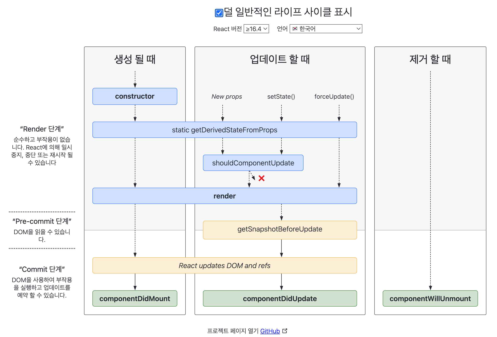

# 2.4 렌더링은 어떻게 일어나는가?

> ### You will learn 🌲
>- 2.4.1 리액트의 렌더링이란?
>- 2.4.2 리액트의 렌더링이 일어나는 이유
>- 2.4.3 리액트의 렌더링 프로세스
>- 2.4.4 렌더와 커밋
>- 2.4.5 일반적인 렌더링 시나리오 살펴보기

---

브라우저에서의 렌더링은 HTML과 CSS 리소스를 기반으로 웹페이지에 필요한 UI를 그리는 과정  
리액트의 렌더링은 브라우저가 렌더링에 필요한 DOM 트리를 만드는 과정  

# 2.4.1 리액트의 렌더링이란?
- 렌더링은 브라우저에서도 사용되는 용어이므로 두 가지를 혼동해서 사용하면 안 된다!
- 리액트에서의 렌더링이란 
    - 리액트 앱 트리 안에 있는 모든 컴포넌트들이 현재 자신들이 가지고 있는 Props와 state를 기반으로 
    - 어떻게 UI를 구성하고 이를 바탕으로 어떤 DOM 결과를 브라우저에 제공할 것인지 계산하는 일련의 과정을 의미한다.

<br/>

# 2.4.2 리액트의 렌더링이 일어나는 이유

렌더링이 일어나는 경우는 이 아래의 시나리오가 전부다!!

## 최초 렌더링
- 유저가 앱에 처음 진입하면 최초 렌더링을 수행함

## 리렌더링
### 1) setState
### 2) useReducer의 dispatch 실행
### 3) 클래스 컴포넌트의 forceUpdate
- 주의) forceUpdate를 실행하면 개발자가 강제로 선언한 것이라고 간주해 ShouldComponentUpdate는 무시하고 건너뛴다. 자식 컴포넌트도 동일!
### 4) 컴포넌트의 key props 변경
- 리액트에서 key는 명시적으로 선언돼 있지 않더라도 모든 컴포넌트에서 사용할 수 있는 특수한 props
- key가 필요한 이유
    - key는 리렌더링이 발생하는 동안 형제 요소들 사이에서 동일한 요소를 식별하는 값
    - 리액트 파이버 트리 구조에서는 해당 트리 구조에서 형제 컴포넌트를 구별하기 위해 각자 sibling이라는 속성값을 사용했다.
    - 동일한 자식 컴포넌트가 여러 개 있으면, 리렌더링이 발생할 때 current 트리와 workInProgress 트리 사이에서 어떤 컴포넌트가 변경이 있었는지 구별해야 하는데, 이때 같은 컴포넌트인지를 구별하는 값이 바로 key다.
    - key가 없으면 단순히 파이버 내부의 **sibling 인덱스**만을 기준으로 판단하게 된다.
    - key에 Math.random()처럼 매번 변하는 값을 넣으면 매번 리렌더링이 일어난다. 
    - 즉, key의 변화는 리렌더링을 야기하므로, key를 활용해 강제로 리렌더링을 일으키는 것이 가능하다.
### 5) props 변경
### 6) 부모 컴포넌트가 렌더링되는 경우
- 부모 컴포넌트가 리렌더링되면 자식 컴포넌트도 무조건 리렌더링이 일어난다.

💡 반면, MobX와 Redux는 라이브러리 어디에선가 각자의 방법으로 상태를 관리해주지만, 이 상태의 변화가 리렌더링으로 이어지지는 않는다.  

<br/>

# 2.4.3 리액트의 렌더링 프로세스
다음으로 렌더링이 어떤 과정을 거쳐 수행되는지 알아보자!

- 렌더링 프로세스가 시작되면 컴포넌트의 루트에서부터 아래쪽으로 내려가면서 업데이트가 필요하다고 지정돼 있는 모든 컴포넌트를 찾는다.
- 업데이트가 필요한 컴포넌트를 발견하면 '클래스 컴포넌트는 render() 함수를 실행' / '함수 컴포넌트는 FunctionComponent() 그 자체를 호출'하고 그 결과물을 저장한다.
- 일반적으로 렌더링 결과물은 JSX 문법으로 구성돼 있고, JS로 컴파일되면서 React.createElement()를 호출하는 구문으로 변환된다.
    - createElement는 브라우저의 UI 구조를 설명할 수 있는 일반적인 JS 객체를 반환한다.
- 렌더링 프로세스가 실행되면서 이런 과정을 거쳐 컴포넌트의 렌더링 결과물을 수집하고,
- 리액트의 새로운 트리인 가상 DOM과 비교해 실제 DOM에 반영하기 위한 모든 변경사항을 수집해나간다.
    - 이렇게 계산하는 과정을 리액트의 재조정(Reconciliation)이라고 한다.
- Reconciliation이 끝나면 모든 변경사항을 하나의 동기 시퀀스로 DOM에 적용해 변경된 결과물이 보이게 된다.

<br/>

# 2.4.4 렌더와 커밋
## 1) 렌더 단계(Render Phase)
- 컴포넌트를 렌더링하고 변경 사항을 계산하는 모든 작업
- 렌더링 프로세스에서 컴포넌트를 실행(render() 또는 return)하고, **이 결과와 이전 가상 DOM을 비교**하는 과정을 거쳐 **변경이 필요한 컴포넌트를 체크**하는 단계
    - 여기에서 비교하는 것은 크게 type, props, key
    - 이 세 가지 중 하나라도 변경된 것이 있으면 변경이 필요한 컴포넌트로 체크함

## 2) 커밋 단계(Commit Phase)
- 변경사항을 실제 DOM에 적용해서 사용자에게 보여주는 과정
- 커밋 단계에서 DOM을 업데이트하면 이렇게 만들어진 모든 DOM 노드를 가리키도록 리액트 내부의 참조를 업데이트한다.
- 그 다음, 클래스 컴포넌트에서는 componentDidMount, componentDidUpdate를 호출하고 / 함수 컴포넌트에서는 useLayoutEffect 훅을 호출한다.

🚨 렌더링이 일어난다고 해서 **항상 DOM 업데이트가 일어나는 것은 아니다** !!
- 렌더링을 수행했으나 커밋 단계까지 갈 필요가 없다면 (변경 사항이 없으면) 커밋 단계는 생략되고 DOM 업데이트가 일어나지 않는다.
- 즉, 리액트의 렌더링은 가시적인 변경이 일어나지 않아도 발생할 수 있다.

### react-lifecycle-methods-diagram 
- 클래스 컴포넌트를 기준으로 작성된 리액트 렌더 단계와 커밋 단계 다이어그램


## 동기식 렌더링 & 비동기식 렌더링
- 이 두 가지 과정으로 이뤄진 리액트의 렌더링은 항상 동기식으로 작동한다.
- 리액트 18 버전에서는 비동기 렌더링(동시성 렌더링)이 도입되었다.
    - 먼저 렌더링 되어야 하는 컴포넌트의 작업이 무거워서 상대적으로 빨리 렌더링 할 수 있는 다른 컴포넌트를 먼저 보여주는 식으로
    - 의도된 우선순위로 컴포넌트를 렌더링해 최적화하는 방식이다.
    - 렌더 단계가 비동기로 작동해 특정 렌더링의 우선순위를 낮추거나, 중단하거나, 재시작하거나, 포기하거나!
    - 브라우저의 동기 작업을 차단하지 않고 백그라운드에서 새로운 리액트 트리를 준비할 수도 있으므로 사용자는 더욱 매끄러운 사용자 경험을 누릴 수 있다.

---

## 1. 리액트의 렌더링 과정이 동기식이 아닌 비동기식으로 작동한다면 어떤 장단점이 있을까요? (주희)
- 단점) 사용자가 하나의 상태에 대해 여러 가지 다른 UI를 보게 되어 혼란을 줄 수 있다.
- 장점) 먼저 렌더링 되어야 하는 컴포넌트의 작업이 무겁다면 상대적으로 빠르게 렌더링할 수 있는 우선순위가 낮은 컴포넌트를 먼저 보여주어 최적화할 수 있다.
- 의도된 우선순위로 컴포넌트를 렌더링해 최적화할 수 있는 동시성 렌더링은 리액트 18에 도입되었다.
- 특정 렌더링의 우선순위를 낮추거나, 중단하거나 재시작하거나, 경우에 따라서는 포기할 수 있다.
- 브라우저의 동기 작업을 차단하지 않고 백그라운드에서 새로운 리액트 트리를 준비할 수도 있으므로 사용자는 더욱 매끄러운 사용자 경험을 누릴 수 있다.


### Q2. A(부모) -> B -> C -> D(자식)로 이어지는 4중 중첩 구조의 컴포넌트가 있습니다. Context API를 사용하여 만든 LoadingProvider로 A 컴포넌트를 감싸 isLoading과 setIsLoading 값을 전달합니다. D 컴포넌트에서 setIsLoading을 호출하여 isLoading의 값을 변경했을 때, 어떻게 렌더링이 일어나게 될까요? (경민)


### Q3. 리액트의 렌더링 과정에 대해서 설명해 주세요. (도영)
- 렌더링 프로세스가 시작되면 컴포넌트의 루트에서부터 아래쪽으로 내려가면서 업데이트가 필요하다고 지정돼 있는 모든 컴포넌트를 찾는다.
- 업데이트가 필요한 컴포넌트를 발견하면 '클래스 컴포넌트는 render() 함수를 실행' / '함수 컴포넌트는 FunctionComponent() 그 자체를 호출'하고 그 결과물을 저장한다.
- 일반적으로 렌더링 결과물은 JSX 문법으로 구성돼 있고, JS로 컴파일되면서 React.createElement()를 호출하는 구문으로 변환된다.
    - createElement는 브라우저의 UI 구조를 설명할 수 있는 일반적인 JS 객체를 반환한다.
- 렌더링 프로세스가 실행되면서 이런 과정을 거쳐 컴포넌트의 렌더링 결과물을 수집하고,
- 리액트의 새로운 트리인 가상 DOM과 비교해 실제 DOM에 반영하기 위한 모든 변경사항을 수집해나간다.
    - 이렇게 계산하는 과정을 리액트의 재조정(Reconciliation)이라고 한다.
- Reconciliation이 끝나면 모든 변경사항을 하나의 동기 시퀀스로 DOM에 적용해 변경된 결과물이 보이게 된다.

### Q4. 컴포넌트를 `memo`로 선언했음에도 매번 리렌더링 되는 경우 원인에 어떤 것이 있을까요? (채림)

### Q5. 아래 코드의 렌더링 시나리오를 설명해주세요. (승훈)
```js
function Counter() {
  const [count, setCount] = useState(0);

  const handleClick = () => {
    setCount(count + 1);
  };

  return (
    <div>
      <p>Count: {count}</p>
      <button onClick={handleClick}>Increment</button>
    </div>
  );
}
```